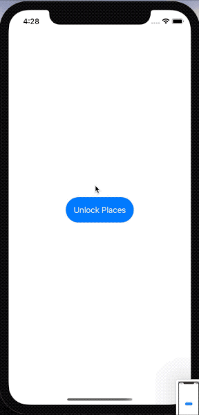

# BucketList

**Place markers on a map with places you want to visit before hitting... the bucket.**



#### Tech used:
- SwiftUI 
- MapKit & SwiftUI integration using UIViewRepresentable
- LocalAuthentication (TouchID & FaceID)

## Day 68 - Comparable & View States
Adding conformance to **Comparable** to our data model requires providing an implementation to the < function:

```Swift
struct User: Identifiable, Comparable {
    let id = UUID()
    let firstName: String
    let lastName: String

    static func < (lhs: User, rhs: User) -> Bool {
        lhs.lastName < rhs.lastName
    }
}
```
And now we get sorted for free. This is a much better/cleaner option compared to messing with the data structure in the Views.

### View States
We can model our view states in an enum, however instead of 'switching' on it we have to:
```Swift
Group {
    if loadingState == .loading {
        LoadingView()
    } else if loadingState == .success {
        SuccessView()
    } else if loadingState == .failed {
        FailedView()
    }
} 
```

## Day 69 - Integrating MapKit with SwiftUI & FaceID authentication
MKMapView is an UIView, so we have to make use of the UIViewRepresentable protocol. And then add the Coordinator class in order to implement the delegate methods.

### TouchID & FaceID
Import the LocalAuthentication library.

https://www.hackingwithswift.com/books/ios-swiftui/using-touch-id-and-face-id-with-swiftui

## Day 70 - Annotations & the Coordinator class

## Day 71 - Extending existing types to support ObservableObject
```Swift
extension MKPointAnnotation: ObservableObject {
    public var wrappedTitle: String {
        get {
            self.title ?? "Unknown value"
        }

        set {
            title = newValue
        }
    }

    public var wrappedSubtitle: String {
        get {
            self.subtitle ?? "Unknown value"
        }

        set {
            subtitle = newValue
        }
    }
} 
```


## Day 72

## Day 73 - Challenge
1. Our + button is rather hard to tap. Try moving all its modifiers to the image inside the button – what difference does it make, and can you think why?
2. Having a complex if condition in the middle of ContentView isn’t easy to read – can you rewrite it so that the MapView, Circle, and Button are part of their own view? This might take more work than you think!
3. Our app silently fails when errors occur during biometric authentication. Add code to show those errors in an alert, but be careful: you can only add one alert() modifier to each view.